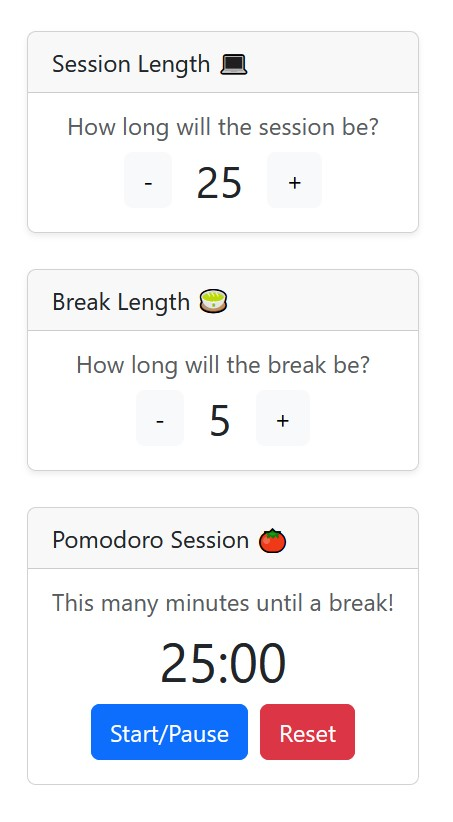

# freeCodeCamp 25 + 5 (Pomodoro) Clock

Submission for freeCodeCamp's "Front End Development Libraries" course.

To see the tests passing, open the testing widget in the upper-left corner, select "25 + 5 Clock" from the dropdown, and then click the "Run Tests" button.

This project uses [Bootstrap](https://getbootstrap.com/) for component design.

